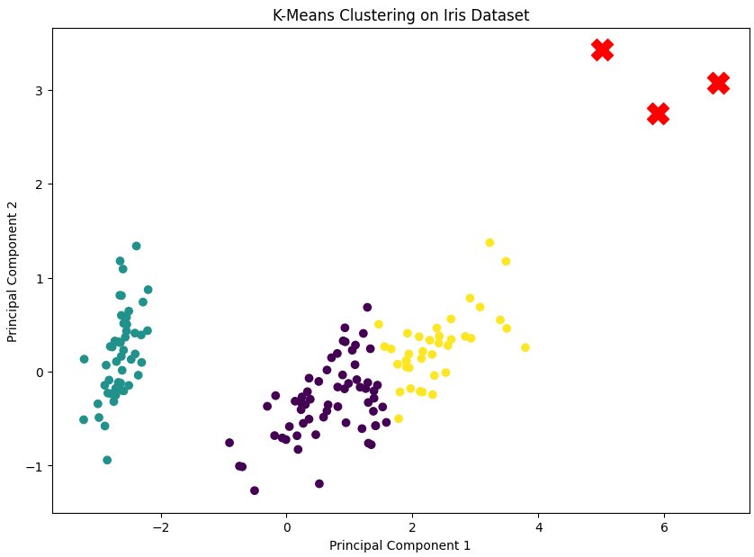
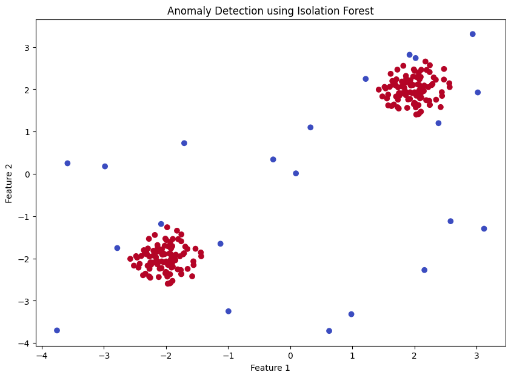

# Unsupervised Learning

---

## Introduction

Unsupervised learning is a type of machine learning where the model is trained on data without labeled responses. Instead of relying on pre-defined labels, the objective is to uncover hidden patterns or intrinsic structures within the input data. This approach is particularly useful when dealing with large datasets where labeling each data point is impractical or impossible.

## Types of Unsupervised Learning:

Broadly 3 techniques of Unsupervised Learning are used:

### Clustering:

Clustering is the task of dividing a dataset into groups, or clusters, of similar items. Items in the same cluster are more similar to each other than to those in other clusters. This technique is widely used for customer segmentation, market research, and image compression. Clustering helps to find natural groupings within data, providing insights into the underlying patterns and structures.

Let's delve deeper into clustering by using the K-Means clustering algorithm on the Iris dataset. K-Means is one of the simplest and most popular unsupervised learning algorithms. It aims to partition 'n' observations into 'k' clusters in which each observation belongs to the cluster with the nearest mean.

1. Importing Libraries: We import the necessary libraries, including NumPy, Pandas, Scikit-Learn, and Matplotlib.
```python
import numpy as np
import pandas as pd
from sklearn.datasets import load_iris
from sklearn.cluster import KMeans
import matplotlib.pyplot as plt
from sklearn.decomposition import PCA
```
2. Loading the Dataset: We use the 'load_iris' function from Scikit-Learn to load the Iris dataset. The Iris dataset is used for example purpose.
```python
iris = load_iris()
X = iris.data
```
3. Applying K-Means Clustering: We initialize the K-Means clustering algorithm with 'n_clusters=3' and fit it to the dataset.
```python
kmeans = KMeans(n_clusters=3, random_state=42)
kmeans.fit(X)
```
4. Getting Cluster Labels: After fitting the model, we obtain the labels for each data point, indicating the cluster to which each point belongs.
```python
labels = kmeans.labels_
```
5. Reducing Dimensions for Visualization: Since visualizing high-dimensional data can be challenging, we use PCA to reduce the dataset to 2 dimensions.
```python
pca = PCA(n_components=2)
X_reduced = pca.fit_transform(X)
```
6. Plotting the Clusters: We use Matplotlib to create a scatter plot of the data points in the reduced dimensional space, coloring them according to their cluster labels. The cluster centroids are marked with red 'X' markers. This is for visualization purpose.
```python
plt.figure(figsize=(10, 7))
plt.scatter(X_reduced[:, 0], X_reduced[:, 1], c=labels, cmap='viridis')
plt.scatter(kmeans.cluster_centers_[:, 0], kmeans.cluster_centers_[:, 1], s=300, c='red', marker='X')
plt.title('K-Means Clustering on Iris Dataset')
plt.xlabel('Principal Component 1')
plt.ylabel('Principal Component 2')
plt.show()
```
Output:


### Dimensionality Reduction:

Dimensionality reduction is the process of reducing the number of input variables or features in a dataset while retaining as much information as possible. This technique is crucial when dealing with high-dimensional data, as it helps to mitigate the curse of dimensionality, reduce computational cost, and improve model performance. Common techniques include Principal Component Analysis (PCA) and t-Distributed Stochastic Neighbor Embedding (t-SNE).

Let's explore dimensionality reduction using Principal Component Analysis (PCA) on the Iris dataset. PCA is a technique that transforms the data into a new coordinate system where the greatest variances by any projection of the data come to lie on the first coordinates (called principal components), the second greatest variances on the second coordinates, and so on.

1. Importing Libraries: We import the necessary libraries, including NumPy, Pandas, Scikit-Learn, and Matplotlib.
```python
import numpy as np
import pandas as pd
from sklearn.datasets import load_iris
from sklearn.decomposition import PCA
import matplotlib.pyplot as plt
```
2. Loading the Dataset: We use the 'load_iris' function from Scikit-Learn to load the Iris dataset. The Iris dataset is used for example purpose.
```python
iris = load_iris()
X = iris.data
y = iris.target
```
3. Applying PCA: We initialize PCA with 'n_components=2', which means we want to reduce the data to two dimensions. We then fit PCA to the dataset and transform the data.
```python
pca = PCA(n_components=2)
X_pca = pca.fit_transform(X)
```
4. Plotting the PCA Results: We use Matplotlib to create a scatter plot of the data points in the reduced two-dimensional space, coloring them according to their class labels. This is for visualization purpose.
```python
plt.figure(figsize=(10, 7))
scatter = plt.scatter(X_pca[:, 0], X_pca[:, 1], c=y, cmap='viridis')
plt.title('PCA on Iris Dataset')
plt.xlabel('Principal Component 1')
plt.ylabel('Principal Component 2')
plt.colorbar(scatter, label='Classes')
plt.show()
```
Output:


### Anomaly Detection:

Anomaly detection is the identification of rare items, events, or observations which differ significantly from the majority of the data. This technique is used for detecting fraud, network intrusions, or equipment failures. Anomalies, also known as outliers, can be indicative of significant but rare events that require special attention.

Let's explore anomaly detection using the Isolation Forest algorithm. Isolation Forest is an efficient method for anomaly detection that isolates observations by randomly selecting a feature and then randomly selecting a split value between the maximum and minimum values of the selected feature. The logic is that anomalies are few and different, thus they are easier to isolate.

1. Importing Libraries: We import the necessary libraries, including NumPy, Pandas, Scikit-Learn, and Matplotlib.
```python
import numpy as np
import pandas as pd
from sklearn.ensemble import IsolationForest
import matplotlib.pyplot as plt
```
2. Generating Synthetic Data: We create a synthetic dataset consisting of two clusters of normal data points and some random outliers.
```python
np.random.seed(42)
X = 0.3 * np.random.randn(100, 2)
X_train = np.r_[X + 2, X - 2]
X_outliers = np.random.uniform(low=-4, high=4, size=(20, 2))
X = np.r_[X_train, X_outliers]
```
3. Applying Isolation Forest: We initialize the Isolation Forest with a contamination rate of 10% (the proportion of outliers in the dataset) and fit it to the data.
```python
clf = IsolationForest(contamination=0.1, random_state=42)
clf.fit(X)
```
4. Predicting Anomalies: The 'predict' method of the Isolation Forest model assigns a label to each data point, indicating whether it is an inlier (1) or an outlier (-1).
```python
y_pred = clf.predict(X)
```
5. Plotting the Results: We use Matplotlib to create a scatter plot of the data points, coloring them according to their anomaly labels. This is for visualization purpose.
```python
plt.figure(figsize=(10, 7))
plt.scatter(X[:, 0], X[:, 1], c=y_pred, cmap='coolwarm', marker='o')
plt.title('Anomaly Detection using Isolation Forest')
plt.xlabel('Feature 1')
plt.ylabel('Feature 2')
plt.show()
```
Output:


## Conclusion

Unsupervised learning encompasses a broad range of techniques designed to find hidden patterns and structures in data without the use of labeled responses. The three primary categories—clustering, dimensionality reduction, and anomaly detection—each serve unique purposes and have distinct applications across various fields.

#### Clustering:
Clustering algorithms like K-Means are invaluable for segmenting data into meaningful groups. This is particularly useful in customer segmentation, market research, and image compression. By grouping similar data points together, clustering helps reveal the underlying structure of the data, which can inform strategic decisions and uncover patterns that would otherwise remain hidden.

#### Dimensionality Reduction:
Techniques like PCA reduce the number of features in a dataset while preserving its essential information. This is crucial for handling high-dimensional data, as it helps mitigate the curse of dimensionality, reduce computational costs, and improve the performance of machine learning models. Dimensionality reduction also aids in data visualization, allowing us to project complex data into two or three dimensions for easier interpretation.

#### Anomaly Detection:
Anomaly detection methods such as Isolation Forest are used to identify rare and significant deviations from the norm. These outliers can indicate critical events such as fraud, network intrusions, or equipment failures. By detecting anomalies, organizations can take proactive measures to address potential issues before they escalate.

## Practical Applications:

#### Customer Segmentation:
Clustering algorithms can segment customers based on purchasing behavior, enabling personalized marketing strategies.
#### Data Compression:
Dimensionality reduction techniques can compress images and reduce storage requirements while maintaining visual quality.
#### Fraud Detection:
Anomaly detection algorithms can identify unusual transactions that may indicate fraudulent activity, helping financial institutions prevent losses.

## Future Directions:

As unsupervised learning continues to evolve, its applications will expand into new domains. Advances in algorithms and computational power will enable the analysis of increasingly complex datasets, uncovering deeper insights and facilitating more informed decision-making. Combining unsupervised learning with other machine learning techniques, such as supervised learning and reinforcement learning, will further enhance its capabilities and broaden its impact.

## Further Reading

Scikit-Learn Documentation: https://scikit-learn.org/stable/documentation.html
"Pattern Recognition and Machine Learning" by Christopher M. Bishop
